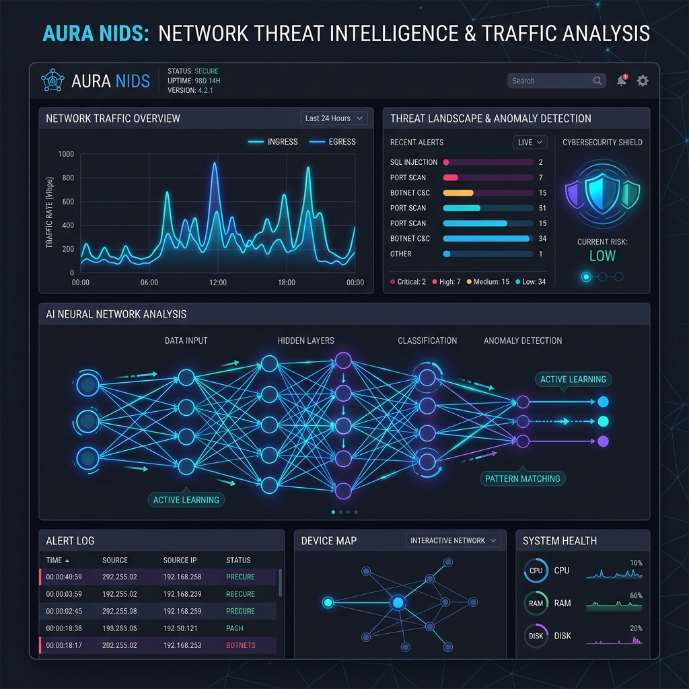

# AI-Powered Network Intrusion Detection & Incident Reporting



##  Overview
This project is a cutting-edge **Network Intrusion Detection System (NIDS)** that leverages Machine Learning and Natural Language Processing to detect, visualize, and report network threats in real-time. By combining the high-performance classification of **XGBoost** with the generative power of **Hugging Face Transformers**, it not only identifies attacks but also provides human-readable incident summaries.

**Project Resources:** [Google Drive Link](https://drive.google.com/file/d/1R_p99uq1NKp85WRHIxRBCwn6onHQy2Uu/view?usp=sharing)


---

##  Key Features

- **Multi-Class Attack Detection**: Utilizes a trained XGBoost classifier to distinguish between `BENIGN` traffic and various attack types like `PortScan`, `DDoS`, and more.
- **NLP Incident Reporting**: Automatically generates descriptive incident summaries using the `DistilGPT2` model based on detected traffic patterns.
- **Real-Time Simulation**: Dynamic Streamlit dashboards that simulate network flow timelines and node-based attack spread.
- **Advanced Data Pipeline**: Comprehensive preprocessing scripts to handle large-scale PCAP-derived CSV datasets, including feature scaling and categorical encoding.
- **Interactive Visualizations**: High-quality plots using `NetworkX`, `Matplotlib`, and `Seaborn` to provide deep insights into network health.

---

##  Tech Stack

| Category | Tools & Libraries |
| :--- | :--- |
| **Core AI** | Python, XGBoost, Scikit-Learn |
| **NLP** | Hugging Face Transformers (DistilGPT2), PyTorch |
| **Data Processing** | Pandas, Numpy |
| **Visualization** | Streamlit, NetworkX, Matplotlib, Seaborn |
| **Environment** | Jupyter Notebooks, Joblib |

---

##  Project Structure

```bash
AI_Project/
├── Dataset/                   # Raw network traffic datasets (CSV)
├── Model/                     # Saved model artifacts (XGBoost, Scaler, etc.)
├── ABA_Datacleaning.ipynb     # Interactive data exploration and cleaning
├── Data_Cleaning.py           # Production-ready data cleaning script
├── Model_Training_and_Testing.py # Training pipeline for the XGBoost model
├── NLP_model.py               # Incident description generation logic
├── Visualization.py           # Node-based attack simulation dashboard
├── Timeline_visual.py         # Real-time traffic timeline simulation
├── Simulations.py             # Script for analyzing attack patterns
└── final_cleaned_dataset.csv  # Preprocessed data ready for training
```

---

##  Installation

1. **Clone the Repository**:
   ```bash
   git clone https://github.com/your-username/AI-NIDS-Project.git
   cd AI-NIDS-Project
   ```

2. **Set Up Virtual Environment**:
   ```bash
   python -m venv .venv
   source .venv/bin/activate  # On Windows: .venv\Scripts\activate
   ```

3. **Install Dependencies**:
   ```bash
   pip install pandas numpy scikit-learn xgboost transformers torch streamlit networkx matplotlib seaborn joblib
   ```

---

##  Usage

### 1. Data Cleaning
Clean the raw dataset before training:
```bash
python Data_Cleaning.py
```

### 2. Model Training
Train the XGBoost classifier and save the artifacts:
```bash
python Model_Training_and_Testing.py
```

### 3. Run Simulations
Launch the interactive Streamlit dashboards:
```bash
# For Node-based simulation
streamlit run Visualization.py

# For Timeline-based simulation
streamlit run Timeline_visual.py
```

---

##  Model Performance
The XGBoost model is optimized for high precision and recall, ensuring minimal false positives in a production environment. 

> [!TIP]
> Use the `device='cuda'` parameter in the training script if you have an NVIDIA GPU to significantly speed up the training process.

---

##  Contributing
Contributions are welcome! Please feel free to submit a Pull Request or open an issue.

---

##  License
This project is licensed under the MIT License.
